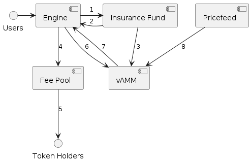

# Margined Protocol Architecture

This is the internal architecture document for Margined Protocol

## Overview

There are five different contracts in the Protocol

- Margin Engine
- Virtual automated market maker (vAMM)
- Insurance Fund
- Fee Pool
- Pricefeed

The Engine is the point of interaction for users with the protocol, and most methods in the other contracts check whether the sender is the Engine. The Engine allows people to open/close positions, and to add/remove margin from existing positions

### How the contracts interact:

### What do the arrows represent?

1: A portion of fees from transactions go to the insurance fund

2: Sometimes, the insurance fund is used to cover shortfall and bad debt that users accrue, to make all creditors whole

3: The insurance fund has the power to shut all the vAMMs down, in the case of an emergency

4 + 5: Like the insurance fund, a portion of fees from transactions in the engine go to the fee pool, and are then distributed to token holders

6: The vAMM calculates the input and output prices when swapping and the Engine uses these to calculate position size

7: The positional data that the vAMM returns is then stored in the Engine. Most of the data is user input, but the vAMM calculates the position size

8: The vAMM calculates the funding payments, and to do so it receives pricing data from the on-chain oracle, which is implemented via the Pricefeed contract

### Margin Engine

The Engine owns all of the contracts. This means that most of the methods that exist in the other contracts will error if the sender is not the Engine.

The Engine can open and close positions, which sends a message to the vAMM to fetch a price and alter the reserves. The positional data is then returned to the Engine and stored. Users can also add or remove margin from existing positions through the Margin Engine, and positions are liquidated via the Engine.

During these transactions, a fee is charged by the protocol. This fee is split and some of it is sent to the Fee Pool whilst some of the fee is sent to the Insurance Fund.

The Engine also controls pausing of the vAMM via `SetOpen`, but shutdown is still controlled by the Insurance Fund

### vAMM

The vAMM acts as the mechanism for price discovery. The contract records the reserves of base and quote assets, and enables swapping input and output - returning a price to the engine. The vAMM also returns the size of the position that a user purchases, which is the amount of base asset.

The vAMM is also in charge of settling the funding, and does so by querying the pricefeed contract to find the oracle price.

### Insurance Fund

The Insurance Fund is, as the name suggests, a fund used as insurance for the protocol. Any bad debt must be covered by the insurance fund so creditors can be reimbursed - bad debt can be accrued if the price moves quicker than users can be liquidated and users positions reduce more than the margin they have deposited.

### Fee Pool

The Fee Pool receives fees from the transactions in the Engine, and then distributes them to our token holders according to their share of the total token supply. The Fee Pool can support multiple denominations of token.

### Pricefeed

The Pricefeed contract is meant as an integration contract to interface with the oracle and provide accurate external prices to the vAMM. Now, this is for funding payments only, but in the future it might allow for rebasing the vAMM to improve pricing in the vAMM.
